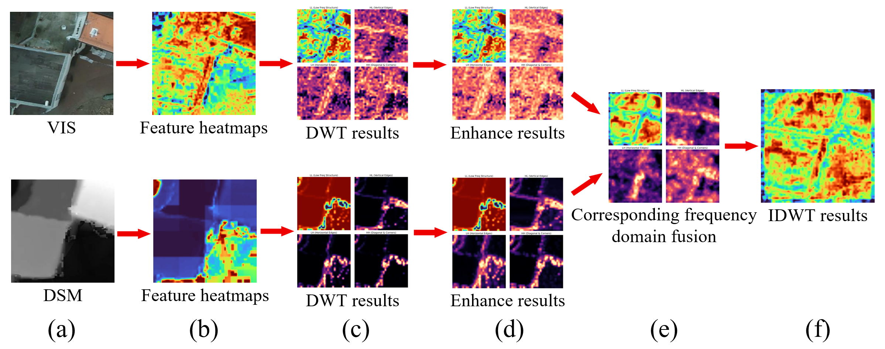
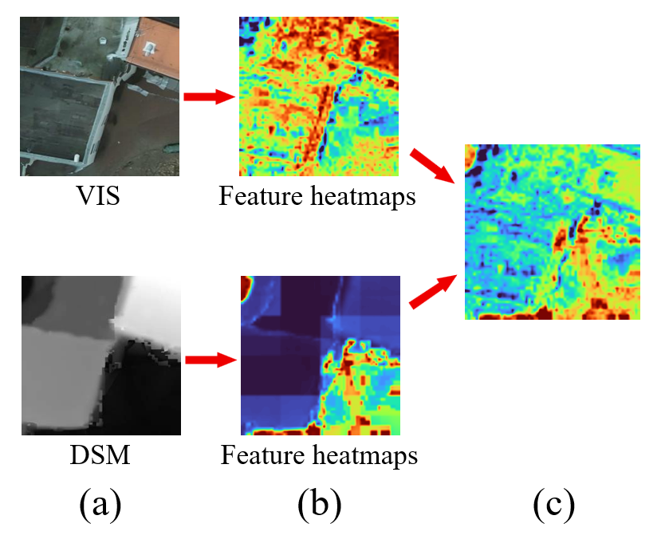
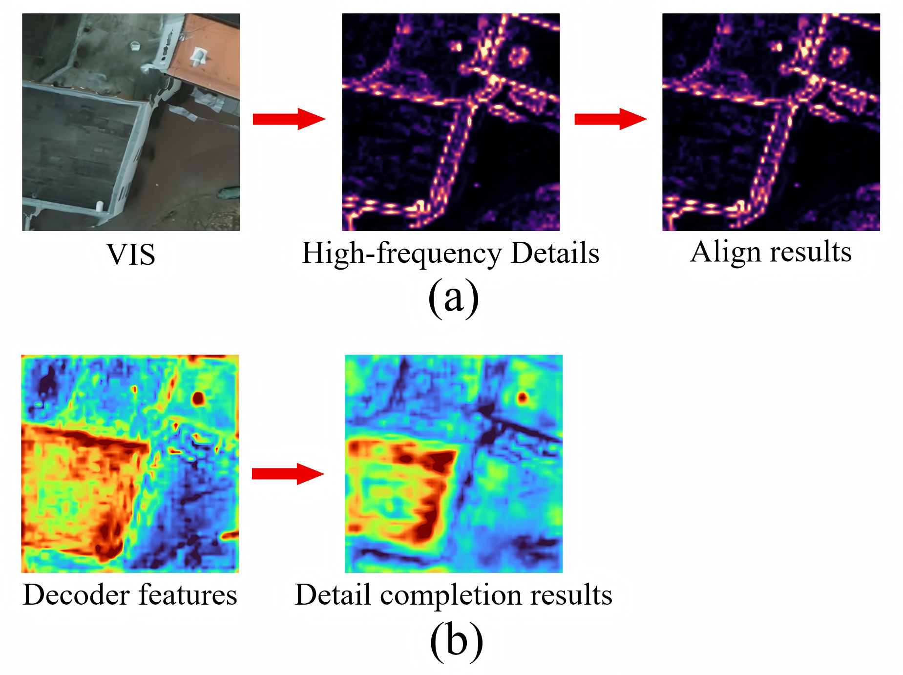
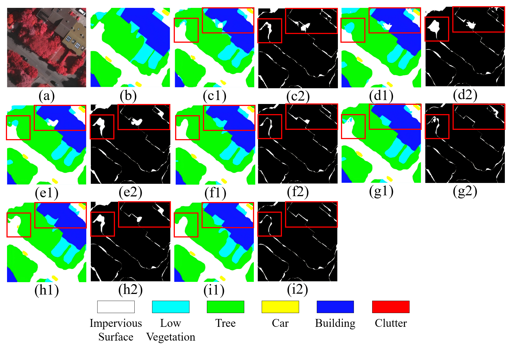
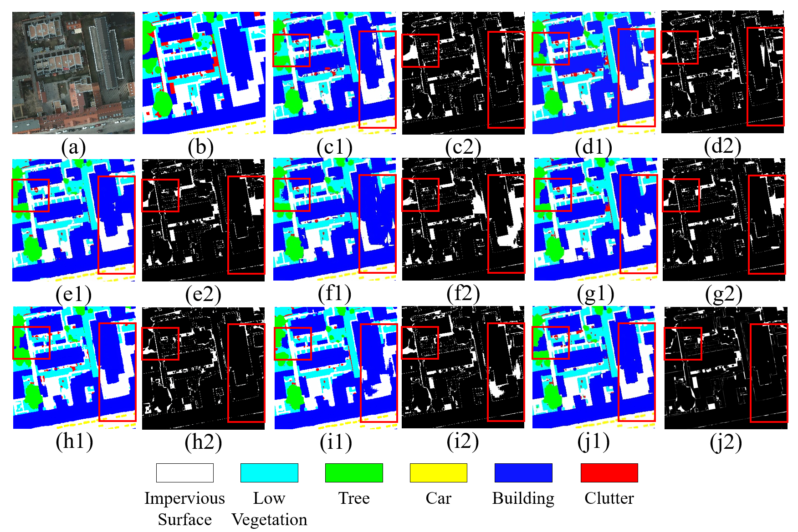

# AFF-Net
Semantic segmentation model for high-resolution remote sensing images
## Visualization

Visual analysis of the weight generation pathway in the proposed frequency-adaptive weighting mechanism. (a) Raw input patches from the VIS and DSM modalities. (b) Feature heatmaps (Following standard heatmap visualization conventions, warmer colors (e.g., dark red) denote strong feature responses). (c) The discrete wavelet transform (DWT) decomposition step, illustrating the low-frequency structure (LL) and high-frequency details (LH, HL, and HH). (d) Visualization of the frequency-guided spatial weights (enhancement strength). [CZ1.1](e) The fused multi-frequency sub-bands obtained by merging the corresponding frequency subbands from both modalities. (f) The final fused feature heatmap reconstructed via the inverse discrete wavelet transform (IDWT).

The baseline fusion method (standard channel-wise concatenation). (a) Raw VIS and DSM input images. (b) Feature heatmaps (Following standard heatmap visualization conventions, warmer colors (e.g., dark red) denote regions with high activation responses). (c) The final fused feature heatmap obtained by directly concatenating the extracted features along the channel dimension, without frequency decomposition or adaptive spatial weighting.
 

Visual analysis of the high-frequency detail alignment process in the decoder. (a) Visualization of the target detail map generation. It displays the high-frequency details extracted from the original input image and the residual calculated against the current decoder features, representing the missing spatial details that require supplementation. (b) The refined decoder feature heatmap after the high-frequency detail compensation, the clearly delineated boundary responses demonstrate the successful restoration of spatial structures.

Visualization of segmentation results and corresponding error maps on the ISPRS Vaihingen dataset. (a) Image. (b) Ground truth. (c–i) Segmentation results of different methods, including ABCNet, CMTFNet, UNetformer, FTUNetformer, MFNet, FTransUNet, and the proposed method. For each method, the first column (denoted as 1, i.e., c1–i1) shows the predicted segmentation maps, while the second column (denoted as 2, i.e., c2–i2) presents the corresponding error maps.

Visualization of segmentation results and corresponding error maps on the ISPRS Potsdam dataset. (a) Image. (b) Ground truth. (c–j) Segmentation results of different methods, including ABCNet, A2-FPN, Dcswin, UNetformer, FTUNetformer, MFNet, FTransUNet, and the proposed method. For each method, the first column (denoted as 1, i.e., c1–j1) shows the predicted segmentation maps, while the second column (denoted as 2, i.e., c2–j2) presents the corresponding error maps.

#### Table 2: Quantitative Comparison of Computational Efficiency and Segmentation Performance (Vaihingen Dataset)

| Type | Method | Params (M) | FLOPs (G) | FPS | BF1 | BIoU | mF1 | mIoU |
| :--- | :--- | :--- | :--- | :--- | :--- | :--- | :--- | :--- |
| Transformer-based | FTransUNet | 203.40 | 112.22 | 19.7 | 80.10 | 70.12 | 91.21 | 84.23 |
| Transformer-based | MFNet | 56.01 | 82.46 | 22.5 | 80.25 | 71.05 | 91.09 | 83.96 |
| Transformer-based | **AFF-Net(ours)** | **173.47** | **116.34** | **20.3** | **92.61** | **82.24** | **91.61** | **84.87** |
